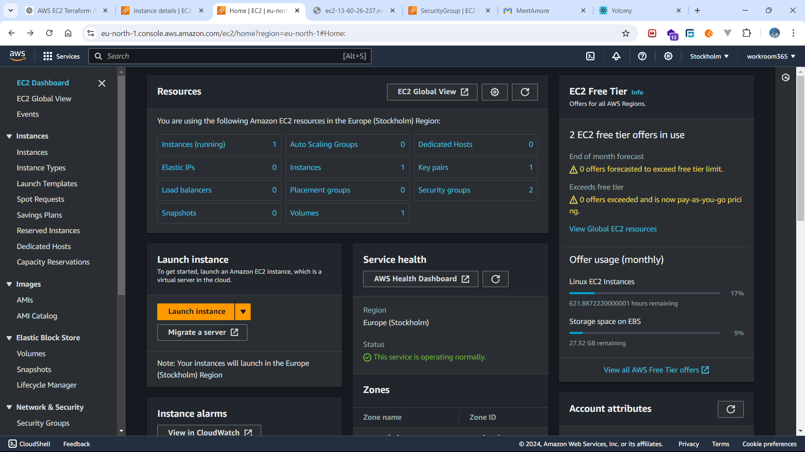

# AWS EC2 Deployment with Terraform, Ansible, and Vagrant

This project demonstrates how to deploy a Docker Compose application to AWS EC2 using Terraform, Ansible, and Vagrant. The setup automates infrastructure provisioning and configuration management for efficient and consistent deployments.

## Table of Contents

1. [Prerequisites](#prerequisites)
2. [Project Structure](#project-structure)
3. [Deployment Process](#deployment-process)
4. [Detailed Steps](#detailed-steps)
5. [Troubleshooting](#troubleshooting)

## Prerequisites

Before you begin, ensure you have the following installed and configured:

- **AWS CLI**: Configured with your AWS credentials.
- **Terraform**: Installed on your local machine.
- **Vagrant**: Installed on your local machine to manage the Ansible environment.
- **VirtualBox**: Installed as the provider for Vagrant VMs.
- **Ansible**: Installed within the Vagrant-managed VM.
- **SSH Key Pair**: Ensure the `ec2deploy` key pair exists in AWS, and `ec2deploy.pem` is located in the project root.

## Project Structure

project-root/
│
├── Vagrantfile            # Vagrant configuration for setting up a VM with Ansible
├── main.tf                # Terraform configuration file for AWS resources
├── ansible/
│   └── playbook.yml       # Ansible playbook to configure the EC2 instance
├── docker-compose.yml     # Docker Compose file defining application services
└── ec2deploy.pem          # SSH private key for accessing the EC2 instance

## Deployment Process

The deployment process involves the following steps:

1. **Vagrant**: Sets up a local VM environment to run Ansible.
2. **Terraform**: Provisions the AWS EC2 instance and necessary infrastructure.
3. **Ansible**: Configures the EC2 instance, installs Docker and Docker Compose, and deploys the application using the `docker-compose.yml` file.

## Detailed Steps

### 1. Setting Up the Ansible Environment with Vagrant

- Vagrant is used to create a virtual machine where Ansible is installed.
- The `Vagrantfile` sets up an Ubuntu environment and provisions it with Ansible.

```ruby
Vagrant.configure("2") do |config|
  config.vm.box = "geerlingguy/ubuntu2004"
  config.vm.provision "ansible_local" do |ansible|
    ansible.playbook = "ansible/playbook.yml"
    ansible.install = true
  end
end
```

### 2. Provisioning Infrastructure with Terraform

- Terraform is used to define and provision AWS resources including an EC2 instance.

```hcl
provider "aws" {
  region = "eu-north-1"
}

resource "aws_instance" "web" {
  ami           = "ami-04ac98afcd13fac1f"
  instance_type = "t3.nano"
  key_name      = "ec2deploy"

  vpc_security_group_ids = ["sg-0c9d0d92cd590555d"]
  subnet_id              = "subnet-05fad511a00c8dd42"

  tags = {
    Name = "Yolo"
  }

  provisioner "remote-exec" {
    inline = [
      "sudo yum update -y",
      "sudo yum install -y docker",
      "sudo service docker start",
      "sudo usermod -aG docker ec2-user",
      "curl -L \"https://github.com/docker/compose/releases/download/1.29.2/docker-compose-$(uname -s)-$(uname -m)\" -o /usr/local/bin/docker-compose",
      "sudo chmod +x /usr/local/bin/docker-compose"
    ]

    connection {
      type        = "ssh"
      user        = "ec2-user"
      private_key = file("${path.module}/ec2deploy.pem")
      host        = self.public_ip
      timeout     = "2m"
    }
  }

  provisioner "local-exec" {
    command = "ANSIBLE_HOST_KEY_CHECKING=False ansible-playbook -i '${self.public_ip},' --private-key ${path.module}/ec2deploy.pem ansible/playbook.yml"
  }
}

output "instance_ip" {
  description = "The public IP address of the web server"
  value       = aws_instance.web.public_ip
}
```

### 3. Configuring the EC2 Instance with Ansible

- Ansible playbook configures the instance to run Docker Compose.

```yaml
---
- hosts: all
  become: true
  tasks:
    - name: Copy docker-compose.yml to the instance
      copy:
        src: ./docker-compose.yml
        dest: /home/ec2-user/docker-compose.yml
        owner: ec2-user
        mode: '0644'

    - name: Run Docker Compose
      shell: |
        cd /home/ec2-user
        docker-compose up -d
```

### Running the Deployment

1. **Initialize Terraform**: Run `terraform init` to initialize the project.
2. **Plan and Apply Terraform**: Use `terraform plan` to review changes and `terraform apply` to deploy resources.
3. **Start Vagrant**: Run `vagrant up` to start the VM and provision Ansible.
4. **Run Ansible Playbook**: The playbook will execute as part of the Terraform local-exec provisioner.
5. **Provision to aws**: ansible-playbook -i inventory playbook.yml
## Troubleshooting

- **SSH Access**: Ensure the security group allows SSH from your IP address.
- **Terraform Errors**: Check syntax and ensure correct paths for SSH keys.
- **Ansible Playbook Errors**: Verify file paths and permissions.

## AWS deployment 



## Conclusion

This setup uses Terraform to manage infrastructure as code, Vagrant to create a consistent Ansible environment, and Ansible playbooks to automate instance configuration. By leveraging these tools, you can streamline deployment processes and maintain consistency across environments.
```
